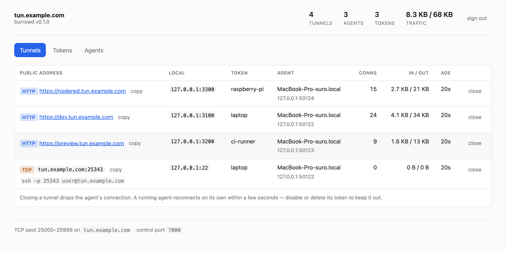
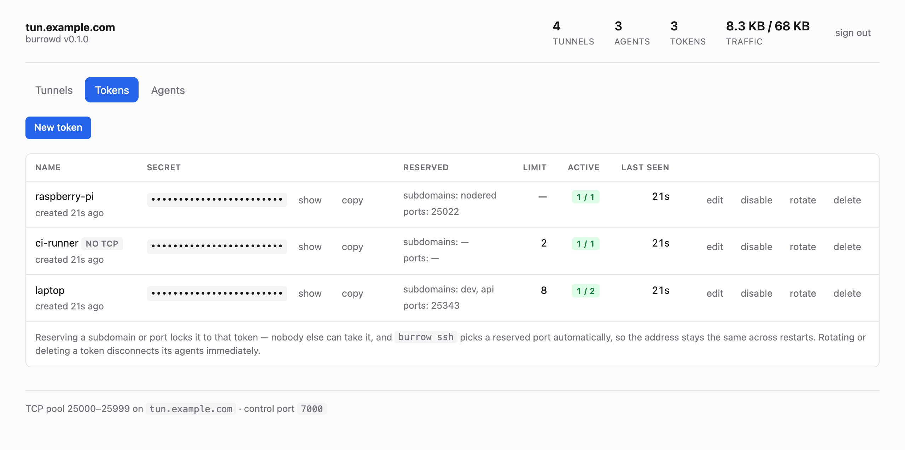

# burrow

[](https://github.com/suro4ek/burrow/actions/workflows/ci.yml)
[](https://github.com/suro4ek/burrow/releases)
[](https://pkg.go.dev/github.com/suro4ek/burrow)
[](LICENSE)

A self-hosted tunnel server: expose a service running on your laptop at a public
URL, or reach it over SSH, using a VPS you control. Think ngrok, but the server
is yours, and it comes with a web panel for handing out tokens.

*[Русская версия](README.ru.md)*

```console
$ burrow http 3000
connected to tun.example.com:7000

  http  https://myapp.tun.example.com

$ burrow ssh
connected to tun.example.com:7000

  tcp   tun.example.com:25343
        ssh -p 25343 you@tun.example.com
```

- **HTTP tunnels** on wildcard subdomains, with websockets and SSE working out
  of the box
- **TCP tunnels** on public ports — SSH, Postgres, anything
- **Stable SSH port**: reserve a port for a token once and `burrow ssh` always
  lands on it, so `~/.ssh/config` keeps working across restarts
- **Web admin panel** to issue and revoke tokens and watch live tunnels,
  compiled into the server binary
- One Go dependency (`hashicorp/yamux`); the server is a single static binary

<picture>
  <source media="(prefers-color-scheme: dark)" srcset="docs/panel-tunnels-dark.png">
  
</picture>

## Install

**Homebrew** — macOS and Linux:

```sh
brew install suro4ek/tap/burrow      # agent
brew install suro4ek/tap/burrowd     # server
```

Or, without Homebrew — **agent**, on the machine you want to expose:

```sh
curl -sSLf https://raw.githubusercontent.com/Suro4ek/burrow/main/install.sh | sh
```

**Server** — on your VPS:

```sh
curl -sSLf https://raw.githubusercontent.com/Suro4ek/burrow/main/install.sh | sh -s -- burrowd
```

No Go, no Docker, no build step. The script picks the build for your OS and
CPU, verifies its SHA-256 against the published checksums, and installs into
`/usr/local/bin` — or `~/.local/bin` if you are not root, rather than demanding
sudo.

```sh
BURROW_VERSION=v0.1.1 ...      # pin a version instead of taking the latest
BURROW_INSTALL_DIR=~/bin ...   # install somewhere else
```

Piping a script into a shell is a reasonable thing to be wary of. Read it first
if you like — it is short: [`install.sh`](install.sh).

<details>
<summary>Other ways to install</summary>

Prebuilt archives for Linux, macOS, FreeBSD and Windows are attached to every
[release](https://github.com/suro4ek/burrow/releases), with `checksums.txt`.

From source, if you have Go:

```sh
go install github.com/suro4ek/burrow/cmd/burrow@latest    # agent
go install github.com/suro4ek/burrow/cmd/burrowd@latest   # server
```

The server also ships as a container image:

```sh
docker pull ghcr.io/suro4ek/burrow:latest
```

</details>

## Try it locally in two minutes

`lvh.me` and every subdomain of it resolve to `127.0.0.1`, so you can see the
whole thing work without touching DNS.

```sh
# Terminal 1 — the server
BURROWD_ADMIN_PASSWORD=devpassword burrowd \
  -domain lvh.me -http 127.0.0.1:8080 -control 127.0.0.1:7000 \
  -tokens tokens.json -admin-addr 127.0.0.1:7002
```

Open <http://127.0.0.1:7002/_admin/>, sign in with `devpassword`, and hit
**New token**. The panel prints a ready-to-paste `burrow login` line.

```sh
# Terminal 2 — the agent
burrow login -server 127.0.0.1:7000 -token <the token> -no-tls
python3 -m http.server 3000 &
burrow http 3000 -subdomain demo

curl http://demo.lvh.me:8080/
```

## Setting up a real server

### 1. DNS

Two records pointing at your VPS:

```
tun.example.com.    A    203.0.113.10
*.tun.example.com.  A    203.0.113.10
```

### 2. TLS

You need a **wildcard** certificate, and a wildcard cannot be issued over the
HTTP-01 challenge — only DNS-01, which needs an API token for your DNS
provider.

With the certificate in hand, burrowd terminates TLS itself — no reverse proxy
needed:

```sh
burrowd -domain tun.example.com \
  -https :443 -redirect-https \
  -tls-cert /etc/burrowd/tls/fullchain.pem \
  -tls-key  /etc/burrowd/tls/privkey.pem
```

The same certificate secures the control port, and renewals are picked up
without a restart: burrowd re-reads the files when their modification time
changes.

[lego](https://go-acme.github.io/lego/) automates the DNS-01 dance for most
providers. If yours is not supported, [`deploy/Caddyfile`](deploy/Caddyfile)
shows the reverse-proxy alternative.

### 3. Run it

With systemd — [`deploy/burrowd.service`](deploy/burrowd.service) is ready to
copy:

```sh
scp burrowd root@vps:/usr/local/bin/
scp deploy/burrowd.service root@vps:/etc/systemd/system/

ssh root@vps '
  useradd --system --no-create-home burrowd
  mkdir -p /etc/burrowd/tls
  openssl rand -base64 24 > /etc/burrowd/admin-password
  chown -R burrowd:burrowd /etc/burrowd
  chmod 600 /etc/burrowd/admin-password
  systemctl enable --now burrowd
'
```

Or with Docker — see [`docker-compose.yml`](docker-compose.yml). Use host
networking: the TCP tunnel pool is a thousand ports, and publishing that range
through the userland proxy is slow and memory-hungry.

`tokens.json` is created on first start; from then on you manage tokens in the
panel.

### 4. Firewall

```sh
ufw allow 80,443/tcp
ufw allow 7000/tcp          # control
ufw allow 20000:30000/tcp   # TCP tunnel pool
```

## Using the agent

```sh
burrow login -server tun.example.com:7000 -token TOKEN   # once

burrow http 3000                     # random subdomain
burrow http 3000 -subdomain myapp    # https://myapp.tun.example.com
burrow http localhost:8080
burrow tcp 5432                      # a port from the pool
burrow ssh                           # local :22, prints the ssh command
burrow ssh -port 25343               # a specific port (must be reserved)
burrow start -tunnel http:3000:myapp -tunnel tcp:22   # several at once

burrow config                        # show the saved login
burrow logout
```

The login is stored in `~/.config/burrow/config.json` with mode `600`.
Precedence is explicit flag → saved login → `BURROW_SERVER` / `BURROW_TOKEN`.

A bare port number means `127.0.0.1`, not `0.0.0.0`, so you cannot accidentally
publish a service that belongs to someone else on your LAN.

Compact form for `-tunnel`:

| Spec | Meaning |
|---|---|
| `http:3000` | local `127.0.0.1:3000`, random subdomain |
| `http:3000:myapp` | subdomain `myapp` |
| `http:localhost:8080` | local `localhost:8080` |
| `tcp:22` | local `127.0.0.1:22`, port assigned by the rules below |
| `tcp:22:25343` | public port `25343` |

## The admin panel

Enabled by setting a password, served on the **bare base domain** at
`https://tun.example.com/_admin/`. Subdomains belong to tunnels, so no tunnel
can shadow it.

The password comes from `-admin-password-file` or `BURROWD_ADMIN_PASSWORD`, and
deliberately **not** from a flag — command-line arguments are visible in `ps`
to every user on the machine. Only a PBKDF2 hash is kept in memory.

- **Tunnels** — live list with public address, local target, owning token,
  connection count, traffic in/out, age.
- **Tokens** — create with reserved subdomains and ports, tunnel limits and an
  HTTP-only switch; edit, disable, rotate, delete. After creating one the panel
  shows the exact `burrow login` command with a copy button.
- **Agents** — connected agents, with a disconnect button.

<picture>
  <source media="(prefers-color-scheme: dark)" srcset="docs/panel-tokens-dark.png">
  
</picture>

Changes apply immediately: `disable`, `rotate` and `delete` drop that token's
agents rather than waiting for a reconnect. Limits and reservations are re-read
from the store on every tunnel request, not frozen at handshake time.

To keep the panel off the public internet, don't set a password on the public
host and bind it to loopback instead:

```sh
burrowd ... -admin-addr 127.0.0.1:7002
ssh -L 7002:127.0.0.1:7002 root@vps    # then open http://127.0.0.1:7002/_admin/
```

## Tokens

`tokens.json` is rewritten by the server whenever the panel changes something,
atomically (temp file, `fsync`, `rename`), so a crash mid-write can never leave
a truncated token list:

```json
[
  {
    "id": "k3m9x2ptqa",
    "token": "the-secret",
    "name": "laptop",
    "subdomains": ["dev", "api"],
    "ports": [25343],
    "max_tunnels": 8,
    "created_at": "2026-08-08T10:00:00Z"
  }
]
```

`subdomains` and `ports` are **reservations**: those names belong to that token
and no other token can take them. By default any authenticated agent may claim
any free subdomain; `-free-subdomains=false` restricts everyone to their own.
Fixed TCP ports work the other way round — you can only request a specific port
if it is reserved for you, unless `-free-ports` is set.

You can edit the file by hand, but it is only read at startup, so restart after
doing so. Files from older versions (without `id`) are migrated automatically.

## How it works

The agent always makes the connection — it has no public IP, the VPS does.
Inside one long-lived TCP/TLS connection, yamux provides many independent
logical streams.

```
browser ──▶ :443 ─▶ Caddy ─▶ burrowd :8080 ─┐  routed by Host: abc.tun.example.com
                                             ├─▶ agent session #7
ssh ──────▶ :25343 ────────▶ burrowd ────────┘  routed by port number
                                             │
                                             │  one connection, yamux streams
                                             ▼
                                    burrow agent ──▶ localhost:3000 / localhost:22
```

For every incoming connection the server opens a fresh stream, writes a
`StreamOpen` header, the agent dials the local service and answers `StreamAck`
— after that it is two `io.Copy` calls.

HTTP tunnels go through `httputil.ReverseProxy` whose `DialContext` opens a
yamux stream instead of a real connection. That gives keep-alive, websockets
and correct `X-Forwarded-*` headers for free.

```
cmd/burrowd/      the server
cmd/burrow/       the agent
internal/proto/   wire protocol: length prefix + JSON
internal/server/  control listener, HTTP router, TCP port pool, token store, admin API
internal/client/  reconnect loop, saved login, tunnel specs
web/              Vite + React panel, embedded with go:embed
deploy/           systemd unit, Caddyfile, example tokens.json
```

## Server flags

| Flag | Default | Purpose |
|---|---|---|
| `-domain` | — | wildcard base domain, required |
| `-control` | `:7000` | listener for agents |
| `-http` | `:80` | listener for end-user traffic |
| `-https` | — | TLS listener for end-user traffic, needs `-tls-cert`/`-tls-key` |
| `-redirect-https` | `false` | make the http listener redirect to https |
| `-scheme` | `http` | scheme used in published URLs; set `https` behind Caddy |
| `-tcp-range` | `20000-30000` | public TCP port pool |
| `-tls-cert` / `-tls-key` | — | TLS for the control listener |
| `-tokens` | `tokens.json` | token store path |
| `-admin-password-file` | — | enables the panel (or `BURROWD_ADMIN_PASSWORD`) |
| `-admin-addr` | — | extra panel listener, e.g. `127.0.0.1:7002` |
| `-auth-hook-url` | — | authenticate agents against your own service |
| `-usage-hook-url` | — | POST traffic reports there (requires `-auth-hook-url`) |
| `-usage-interval` | `60s` | how often usage is reported |
| `-status-token` | — | enables `GET /_status` on the base domain |
| `-free-subdomains` | `true` | let any agent claim any unreserved subdomain |
| `-free-ports` | `false` | let any agent request any unreserved fixed port |
| `-max-tunnels` | `16` | tunnel limit per agent connection |
| `-log-level` | `info` | `debug` logs every stream |

## Delegating auth to your own service

By default `burrowd` is self-contained: tokens live in `tokens.json` and the
panel manages them. Point it at an HTTP endpoint instead and something else
decides who may connect and what they may do:

```sh
burrowd -domain tun.example.com \
  -auth-hook-url  https://api.example.com/v1/authenticate \
  -usage-hook-url https://api.example.com/v1/usage \
  -hook-token-file /etc/burrowd/hook-token
```

This is the seam a hosted service is built on. Accounts, plans, quotas and
billing stay entirely outside the tunnel path — burrowd never learns what a
subscription is, and the same open-source binary runs in both cases.

**Authentication.** Every agent connection produces one POST:

```jsonc
// -> POST /v1/authenticate            Authorization: Bearer <hook token>
{ "token": "…", "hostname": "laptop", "remote_addr": "203.0.113.9:51000",
  "agent_version": "0.1.8", "server_version": "0.1.8", "base_domain": "tun.example.com" }

// <- 200
{ "ok": true, "id": "acct_42", "name": "acme/laptop",
  "subdomains": ["shop"], "ports": [25343], "max_tunnels": 8, "deny_tcp": false }

// <- 200, refusing. The reason is shown to the agent verbatim.
{ "ok": false, "error": "subscription expired" }
```

A non-2xx status is treated as your service being down, not as a bad token:
the agent is told authentication is unavailable and keeps retrying. Answer
`ok:false` when you actually mean no.

**Usage.** Every `-usage-interval` (60s by default) burrowd reports lifetime
totals per tunnel — totals rather than deltas, so a lost report costs nothing
and your side can simply keep the maximum it has seen per `tunnel_id`:

```jsonc
// -> POST /v1/usage
{ "reported_at": "…", "tunnels": [
  { "tunnel_id": "…", "token_id": "acct_42", "proto": "http",
    "public": "https://shop.tun.example.com", "opened_at": "…",
    "conns": 128, "bytes_in": 91234, "bytes_out": 8123456, "closed": false }
]}

// <- 200, cutting off an account that ran out of quota
{ "disconnect": ["acct_42"] }
```

Tunnels that closed since the last report appear once with `"closed": true`,
so short-lived ones are still accounted for. The `disconnect` list is the
enforcement path: it drops those agents immediately, which is how a cancelled
plan stops consuming bandwidth without burrowd knowing anything about plans.

With an auth hook, granted limits are cached for `-hook-cache-ttl` (12h) and
refreshed when the agent reconnects; use `disconnect` to act sooner.

## How this compares

- **[frp](https://github.com/fatedier/frp)** — far more features (P2P, plugins,
  many protocols) and a bigger configuration surface. Pick it if you need
  breadth.
- **[sish](https://github.com/antoniomika/sish)** — uses SSH as the transport,
  so clients need nothing installed at all. Pick it if you cannot deploy an
  agent.
- **[rathole](https://github.com/rapiz1/rathole)** / **[bore](https://github.com/ekzhang/bore)**
  — leaner and faster than this; no admin panel or token management.
- **ngrok / tuna.am** — hosted, nothing to run, but you do not own the server.

burrow's niche: small, readable, one binary, with token management and a panel
built in.

## Development

See [CONTRIBUTING.md](CONTRIBUTING.md). Short version:

```sh
make web      # build the admin panel (Node 24)
make build    # bin/burrow and bin/burrowd
make race     # the test run that matters
```

## What it does not do

Deliberately out of scope: ACME inside burrowd (Caddy does that), a request
inspector like ngrok's, UDP tunnels, rate limiting and traffic quotas, and
clustering — tunnel state lives in one process's memory, so restarting the
server drops tunnels and agents reconnect with backoff. Tokens survive, they
are on disk.

## License

[MIT](LICENSE)
